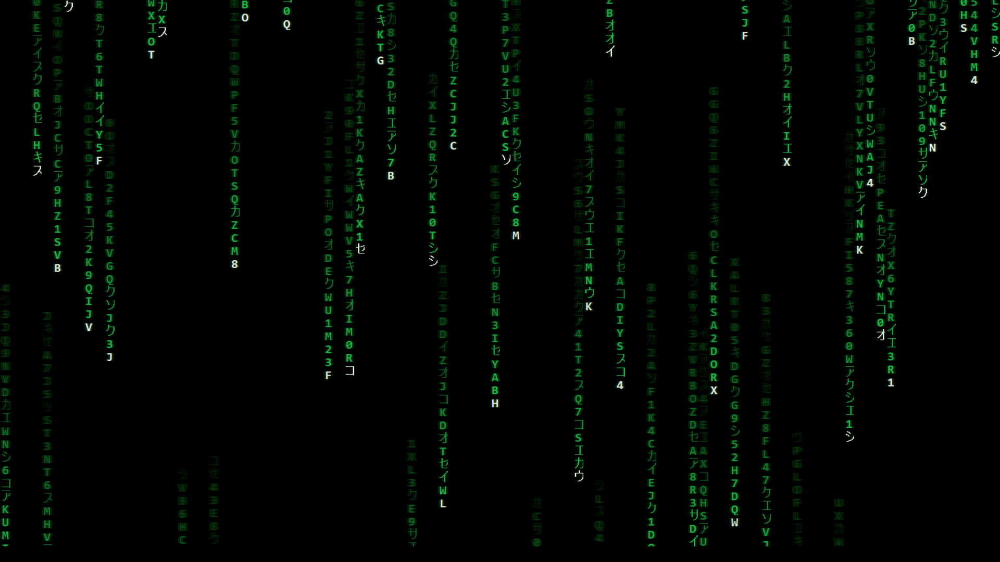

# My Screensaver
A custom Windows screensaver built with .NET WinForms and C#. Lightweight and resource friendly.

Took some info from https://github.com/carlnewton/digital-rain-analysis, but this is not canonical The Matrix animation.

## Installation
1. Download the latest release
2. Copy the `.scr` file to:
   C:\Windows\System32
3. Right-click the file > Install

## License
MIT
